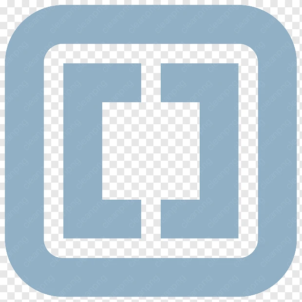

🐧 LINUX CONTENT - Advanced Local HTML5 Video Player
A lightweight, modern, and feature-rich HTML5 video player engineered for local educational and professional use. Built with a sleek dark-mode UI, custom controls, an interactive playlist manager, a real-time audio spectrum visualizer, and live clock widgets.
✨ Features & Capabilities
 * Custom Video Controls: Polished playback interface complete with a responsive seeking scrubber, volume slider, time readouts, and a smooth fullscreen auto-hide mechanism.
 * Folder Auto-Scan & Playlist: Load entire directories of videos via webkitdirectory support to automatically generate an interactive, clickable playlist.
 * Audio Spectrum Visualizer: Real-time canvas-based audio visualizer powered by the Web Audio API featuring a custom yellow-themed gradient.
 * Keyboard Shortcuts: Quick shortcuts like pressing F for fullscreen and Spacebar to play or pause.
 * Real-time Clock & Date Widget: Built-in local clock module directly inside the sidebar control panel.
 * Responsive Layout: Clean desktop workspace layout optimized to keep controls and playlists accessible without cluttering the viewing stage.
💡 Why This Local Solution Is Great (Benefits & Advantages)
Building and utilizing a local HTML5-based video player like this provides unique advantages over traditional heavy desktop media applications (like VLC, MPC-HC, or native OS players):
1. Extreme Lightweightness & No Installation Required
 * Uses Your Existing Browser: Because this runs entirely inside standard web technologies (HTML, CSS, and vanilla JavaScript), it requires zero heavy installations, background daemons, or bloated codec packs.
 * Minimal Resource Consumption: Traditional media players often consume significant CPU and RAM resources indexing media libraries or background services. This browser-based tool uses only the resources of a single browser tab, keeping your system fast and responsive.
2. Universal Cross-Platform Compatibility
 * Works Everywhere: Since modern operating systems (Linux, Windows, macOS, and ChromeOS) all come pre-equipped with modern standards-compliant web browsers (Chrome, Firefox, Edge, Safari), this player works seamlessly across all devices without modification.
 * Linux & ChromeOS Friendly: It is particularly lightweight and ideal for lightweight Linux distributions and ChromeOS environments where native software installation can sometimes be restrictive or cumbersome.
3. Complete Privacy and Offline Capability
 * Local Processing: Your media files never leave your machine. Everything is processed strictly on the client-side within your browser instance, ensuring absolute privacy without tracking, telemetry, or cloud dependencies.
 * Zero Dependencies: It functions completely offline once loaded, making it ideal for travel, offline workstations, or restricted environments without internet access.
🛠️ Where to Customize and Edit
If you want to configure this code for your own GitHub repository or personal workflow, here are the main sections you can modify:
1. Branding & Logos (Header)
Locate the <header> section near the top of the file to change titles, subtitles, or logo image paths:
<header>
     <!-- Change logo image here -->
    

        <h1>VIDEO PLAYER</h1> <!-- Change main heading here -->
        
Video Player, lightweight and easy
 <!-- Change subtitle here -->
    

    
</header>

2. Section Directory Names
To rename or add custom sections in the sidebar control panel, look for the .section-group div:

    <label>Section Directory</label>
    

        <button class="sec-btn active" onclick="switchSection('Holder1', this)">Holder</button>
        <button class="sec-btn" onclick="switchSection('Holder2', this)">Holder</button>
    

3. Styling & Color Palette (CSS Variables)
All core colors, accents, and themes are handled using CSS root variables at the very top of the <style> block:
:root {
    --primary: #0f172a;        /* Main body background */
    --sidebar-bg: #1e293b;     /* Panel and card backgrounds */
    --main-bg: #090d16;        /* Deep background elements */
    --accent: #3b82f6;         /* Primary accent (buttons, highlights) */
    --accent-hover: #2563eb;   /* Accent hover state */
    --yellow: #eab308;         /* Visualizer and badge highlights */
    --text: #f8fafc;           /* Primary text color */
    --text-dim: #94a3b8;       /* Secondary/dimmed text color */
    --border: #334155;         /* Border outlines */
}

4. Footer Information
To update the copyright or purpose note at the bottom of the page, edit the <footer> tag:
<footer>
    Made for Educational and Professional Purposes (Available in Github)
</footer>

🚀 Getting Started & Deployment
 * Clone or Download this repository to your local machine.
 * Ensure your logo assets (Holder.png and Linux Content LOGO.png) are placed in the same directory as your index.html file (or update the src attributes to point to your image URLs).
 * Open index.html in any modern web browser or deploy it directly via GitHub Pages.
